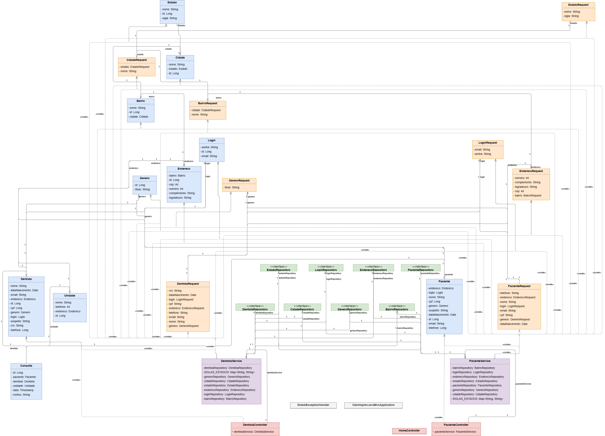
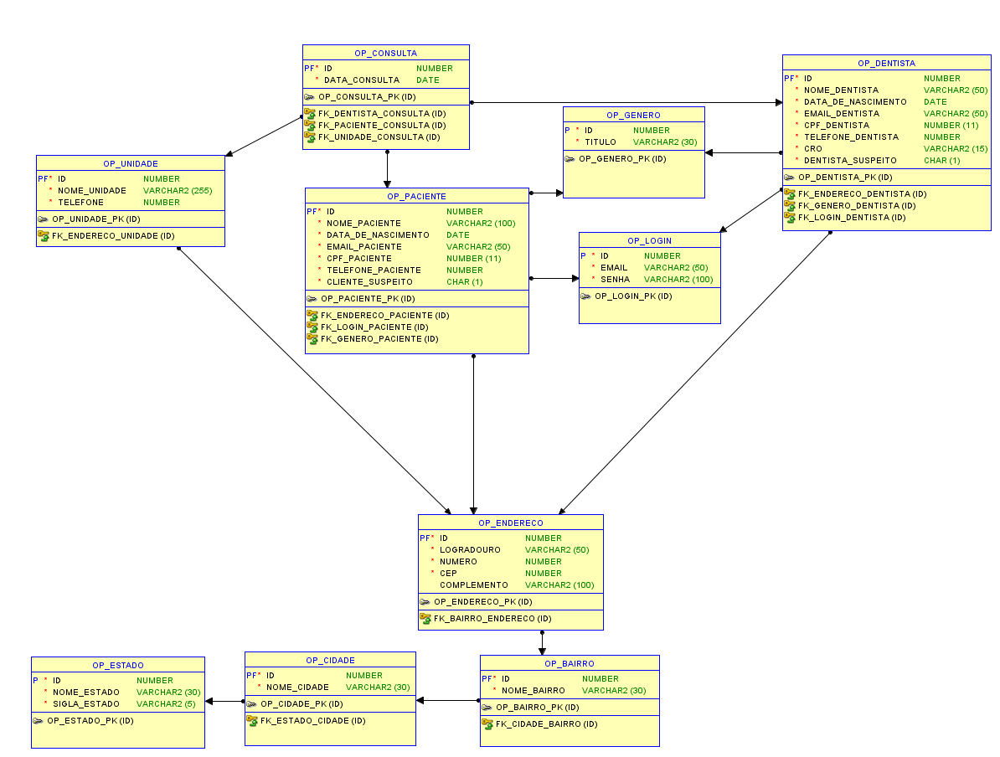
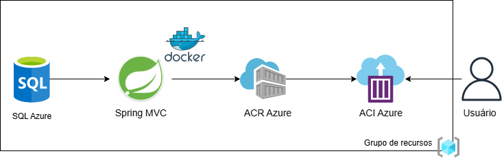

#  🦷 Odontoprev - API para Gerenciamento de Pacientes e Dentistas 

## 📌 Objetivo da Aplicação
A API Odontoprev foi desenvolvida para otimizar o gerenciamento de pacientes e dentistas, permitindo o cadastro, edição, exclusão e listagem de ambos. O sistema visa fornecer uma solução eficiente e segura para a administração de profissionais e clientes na área odontológica.

---

## 🎥 Vídeos Apresentação

**Proposta tecnológica**

🎥 [Proposta tecnológica](https://youtu.be/Uz4d2euEe4U)

**Vídeo demonstrando o deploy até a persistência de dados em Nuvem**

🎥 [Devops-Sprint3](https://youtu.be/Uz4d2euEe4U)

**Demonstração da aplicação funcionando**

🎥 [Apresentação da aplicação](https://youtu.be/Uz4d2euEe4U)

---

## 👥 Equipe

- **Celeste Mayumi Pereira Tanaka (RM552865)** – Responsável pela API em C# e desenvolvimento do modelo preditivo.  
- **Lívia Mariana Lopes (RM552558)** – Responsável pela API em Java e DevOps.  
- **Luana Vieira Santos da Silva (RM552994)** – Responsável pelo desenvolvimento do banco de dados, compliance e quality assurance do projeto.  
- **Todas** – Responsáveis pelo desenvolvimento mobile.  

---

## 🏗️ Arquitetura da Solução
A aplicação foi desenvolvida utilizando Java Spring MVC, seguindo uma arquitetura em camadas para garantir modularidade e escalabilidade. A estrutura se divide em:
- **Model** – Representação das entidades do sistema.  
- **Repository** – Responsável pela comunicação com o banco de dados.  
- **DTO (Data Transfer Object)** – Abstração para troca de dados.  
- **Service** – Contém a lógica de negócios.  
- **Controller** – Gerencia as requisições HTTP da API.  

---

## 📊 Diagramas da Aplicação
📌 **Diagrama de classes**  


📌 **Modelagem do banco de dados**  


📌 **Desenho da arquitetura**


---


## ☁️ Implantação em Nuvem com ACR/ACI 
Esta seção descreve o processo de implantação da API Odontoprev na nuvem utilizando Azure Container Registry (ACR) e Azure Container Instances (ACI), além da configuração do banco de dados no SQL Azure.

### ✅ Passo a passo para execução da aplicação em nuvem
### 1️⃣ Clone o repositório

```sh
git clone https://github.com/LiviaMarianaLopes/odontoprev-spring-mvc.git

cd odontoprev-spring-mvc

```
### 2️⃣ Criação do Banco de Dados no Azure
No portal da Azure, crie um Azure SQL Database e execute o script DDL encontrado [aqui](./DDL.sql) no repositório para criar as tabelas necessárias.

### 3️⃣ Configuração do Banco de Dados na Aplicação

Edite o arquivo build.gradle para incluir o driver do SQL Server:

```gradle
implementation 'com.microsoft.sqlserver:mssql-jdbc:12.4.2.jre11'
```
No arquivo application.properties, comente as configurações existentes e adicione as linhas abaixo (substitua as credenciais pelas suas):
```properties

spring.datasource.url=jdbc:sqlserver://<SEU_HOST>:1433;database=<SEU_BANCO>;trustServerCertificate=false;hostNameInCertificate=*.database.windows.net;loginTimeout=30;
spring.datasource.username=<SEU_USUARIO>
spring.datasource.password=<SUA_SENHA>
spring.datasource.driver-class-name=com.microsoft.sqlserver.jdbc.SQLServerDriver

# Configurações do Hibernate
spring.jpa.database-platform=org.hibernate.dialect.SQLServerDialect
spring.jpa.hibernate.ddl-auto=update
spring.jpa.show-sql=true
spring.jpa.properties.hibernate.format_sql=true
```
### 4️⃣ Deploy da Aplicação no Azure

Login na Azure e Criação do Grupo de Recursos

```sh
az login
```
Depois, crie um Grupo de Recursos:

```sh
az group create --name rg-odontoprev --location eastus
```
Crie o Azure Container Registry (ACR):

```sh

az acr create --resource-group rg-odontoprev --name odontoprevjavarm552558 --sku Basic
```
Autentique-se no ACR:

```sh

az acr login --name odontoprevjavarm552558
```
Construa a imagem Docker:

```sh
docker build -t odontoprev-java .
```
Marque e envie a imagem para o ACR:

```sh
docker tag odontoprev-java odontoprevjavarm552558.azurecr.io/odontoprev-java:v1
docker push odontoprevjavarm552558.azurecr.io/odontoprev-java:v1
```
Crie o Azure Container Instance (ACI) para rodar a aplicação na nuvem:

```sh

az container create --resource-group rg-odontoprev --name odontoprevjavarm552558 \
  --image odontoprevjavarm552558.azurecr.io/odontoprev-java:v1 \
  --cpu 1 --memory 1 \
  --registry-login-server odontoprevjavarm552558.azurecr.io \
  --registry-username odontoprevjavarm552558 \
  --registry-password <SUA_SENHA> \
  --ip-address Public --dns-name-label odontoprevjavarm552558 \
  --ports 3000 80 8080 --os-type Linux
```
Após a implantação, obtenha o endereço IP da API rodando o comando:

```sh
az container show --resource-group rg-odontoprev --name odontoprevjavarm552558 --query ipAddress.ip --output tsv
```
A aplicação estará disponível em:

```cpp
http://<endereço-ip>:8080
```
### 5️⃣ Vídeo demonstrando o deploy até a persistência de dados em Nuvem 
🎥 [Devops-Sprint3](https://youtu.be/Uz4d2euEe4U)


## 📝 Instruções para Rodar a Aplicação
### ✅ Pré-requisitos  
- Java 21 instalado.  

### ▶️ Rodando o Projeto
```sh
# Clone o repositório
 git clone https://github.com/LiviaMarianaLopes/odontoprev-spring-mvc.git

# Navegue até o diretório do projeto
 cd odontoprev-spring-mvc

# Rode a aplicação diretamente pela IDE (IntelliJ ou Eclipse)
```

A API estará disponível em `http://localhost:8080`.  

### 🎞️ Demonstração da aplicação funcionando
🎥 [Apresentação da aplicação](https://youtu.be/Uz4d2euEe4U)

---

## ⚒️ Funcionalidades da API
📌 **Gerenciamento de Dentistas**  
- Cadastro, edição, consulta e exclusão de dentistas.  

📌 **Cadastro de Pacientes**  
- Cadastro, edição, consulta e exclusão de pacientes.  

---

## 📜 Endpoints da API
### 📍 Página inicial
- `GET /` – Página principal.  

### 📍 Dentistas
- `GET /dentista/lista` – Lista os dentistas cadastrados.  
- `GET /dentista/cadastro` – Página de cadastro de dentista.  
- `POST /dentista/cadastrar` – Cadastra um novo dentista.  
- `GET /dentista/edicao/{id}` – Página de edição de dentista.  
- `POST /dentista/{id}` – Edita um dentista.  
- `GET /dentista/{id}` – Exclui um dentista.  

### 📍 Pacientes
- `GET /paciente/lista` – Lista os pacientes cadastrados.  
- `GET /paciente/cadastro` – Página de cadastro de paciente.  
- `POST /paciente/cadastrar` – Cadastra um novo paciente.  
- `GET /paciente/edicao/{id}` – Página de edição de paciente.  
- `POST /paciente/{id}` – Edita um paciente.  
- `GET /paciente/{id}` – Exclui um paciente.  

---

## 🔍 Testes da API
### 📍 Criação de Paciente (POST /paciente/cadastrar)
❌ **Erro**  
  
(Erro devido a dados inválidos).  

✅ **Sucesso**  
  
(Cadastro de paciente realizado com sucesso).  

### 📍 Listagem de Pacientes (GET /paciente/lista)
✅ **Sucesso**  
  

### 📍 Atualização de Paciente (POST /paciente/{id})
✅ **Sucesso**  
  

### 📍 Exclusão de Paciente (GET /paciente/deletar/{id})
✅ **Sucesso**  
  

---

## 💡 Dificuldades Encontradas e Próximos Passos
### 📌 Dificuldades Encontradas
Durante o desenvolvimento da aplicação, algumas dificuldades foram enfrentadas:

- **Relacionamentos no Banco de Dados**: Foi necessário implementar uma lógica para verificar se um endereço já existia antes de cadastrar um novo paciente. Caso o endereço já estivesse no banco, ele deveria ser reutilizado.
- **Validação de E-mail**: A lógica de validação exigiu verificações tanto no cadastro quanto na edição. No cadastro, era necessário garantir que o e-mail não existisse previamente. Já na edição, o sistema precisava verificar se o e-mail já estava cadastrado e garantir que não fosse alterado para um já existente.
 

### 📌 Próximos Passos
- **Autenticação com Spring Security**, incluindo gestão de perfis de segurança.
- **Implementação de internacionalização**, permitindo suporte a múltiplos idiomas.
- **Configuração de mensageria**, incluindo produtores e consumidores.
- **Monitoramento com Spring Boot Actuator**, para fornecer métricas e insights sobre a API.
- **Integração de Inteligência Artificial com Spring AI**, trazendo recursos avançados para a aplicação.
- **Avaliação da viabilidade da solução**, garantindo que ela atende às necessidades do cliente.

---

## 🚀 Conclusão
Este projeto representa um avanço na digitalização do gerenciamento odontológico. A implementação de uma API robusta e segura é essencial para otimizar os processos e reduzir fraudes. 
