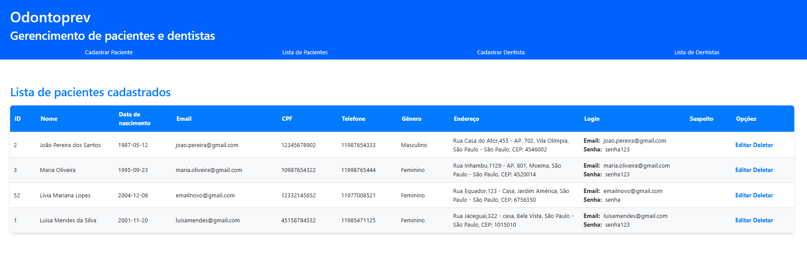

# Odontoprev - API para gerencimento de pacientes e dentistas

## Equipe:
- **Celeste Mayumi Pereira Tanaka** - RM552865: Responsável pela API em C# e desenvolvimento do modelo preditivo.
- **Lívia Mariana Lopes** - RM552558: Responsável pela API em Java e DevOps.
- **Luana Vieira Santos da Silva** - RM552994: Responsável pelo desenvolvimento do banco de dados e compliance e quality assurance do projeto.
- **Todas**: Responsáveis pelo desenvolvimento mobile.

---

##  Instruções para rodar a aplicação
1. **Pré-requisitos**:
  - Certifique-se de ter o Java 21 instalado.

2. **Rodando o Projeto**:
  - Clone o repositório:
    ```shell
    git clone https://github.com/LiviaMarianaLopes/odontoprev-spring-mvc.git
    ```
  - Navegue até o diretório do projeto:
    ```shell
    cd odontoprev-spring-mvc
    ```
  - Rode a aplicação diretamente pela IDE (IntelliJ ou Eclipse) 
  - A API estará disponível em `http://localhost:8080`.

##  Apresentação da Proposta Tecnológica
[Link para o vídeo de apresentação](https://youtu.be/Uz4d2euEe4U )

## Funcionalidades da API

- Gerencimento de Dentistas: Cadastro completo, edição, consulta e exclusão de dentistas.
- Cadastro de Pacientes: Cadastro completo, edição, consulta e exclusão de pacientes.

### EndPoints:

- GET /: Página inicial.
  #### Dentistas
- GET /dentista/lista: Consultar a lista de dentista cadastrados no banco de dados.
- GET /destista/cadastro: Página com formulário para cadastro de dentista.
- POST /dentista/cadastrar: Cadastro de dentista.
- GET /dentista/edicao/{id}: Página com formulário para edição de dentista.
- POST /dentista/{id}: Edição de dentista.
- GET /dentista/{id}: Endpoint para exclusão de dentista.
  #### Pacientes
- GET /paciente/lista: Consultar a lista de pacientes cadastrados no banco de dados.
- GET /paciente/cadastro: Página com formulário para cadastro de paciente.
- POST /paciente/cadastrar: Cadastro de paciente.
- GET /paciente/edicao/{id}: Página com formulário para edição de paciente.
- POST /paciente/{id}: Edição de paciente.
- GET /paciente/{id}: Endpoint para exclusão de paciente.

## Desenvolvimento
O desenvolvimento desta aplicação foi realizado utilizando Java Spring MVC, com uma arquitetura em camadas para garantir a separação de responsabilidades e facilitar a manutenção e escalabilidade do sistema. A aplicação foi dividida nas seguintes camadas principais:

### Estrutura da Aplicação
A aplicação segue o padrão Spring MVC, sendo organizada nas seguintes camadas:

- Model: Representa as entidades de dados do sistema, como Dentista, Paciente, Sinistro, entre outras. Essas classes são mapeadas para as tabelas do banco de dados e contêm os dados que são manipulados pela aplicação.

- Repository: A camada de Repository é responsável pela interação direta com o banco de dados. Utilizamos o Spring Data JPA para criar repositórios que facilitam as operações CRUD (Create, Read, Update, Delete) de maneira eficiente e com mínima configuração.

- DTO (Data Transfer Object): A camada DTO foi criada para abstrair a comunicação entre a API e as camadas externas, como o cliente ou outras aplicações. Os DTOs ajudam a desacoplar a estrutura interna das entidades do banco de dados da forma como os dados são apresentados para o usuário.

- Service: A camada de Service contém a lógica de negócio da aplicação. Ela orquestra a interação entre as entidades, os repositórios e os controladores, garantindo que as operações realizadas sejam válidas e que as regras de negócios sejam cumpridas.

- Controller: A camada Controller é responsável por definir os endpoints da API e manipular as requisições HTTP. Através do Spring MVC, os controladores processam as solicitações e retornam as respostas adequadas, utilizando os serviços para executar as operações solicitadas.
  
##  Testes da API
Abaixo estão os prints de alguns testes realizados na API:

### Testes de Criação de Paciente (POST /paciente/cadastro)

#### Erro


Teste mostrando um erro durante a tentativa de criar uma novo paciente, devido a dados inválidos.

#### Sucesso


Teste mostrando a criação bem-sucedida de uma novo paciente no sistema.

### Teste de Listagem de Pacientes (GET /paciente/lista)

#### Sucesso


Teste mostrando a listagem de todas os pacientes cadastrados.

### Teste de Atualização de Paciente (GET /paciente/edicao/{id})

#### Sucesso


Teste mostrando a atualização bem-sucedida de um paciente existente.

### Testes de Consulta por ID (GET /consultas/{id})

### Teste de Exclusão de Paciente (GET /paciente/deletar/{id})

#### Sucesso


Teste mostrando a exclusão bem-sucedida de um paciente existente no sistema.
